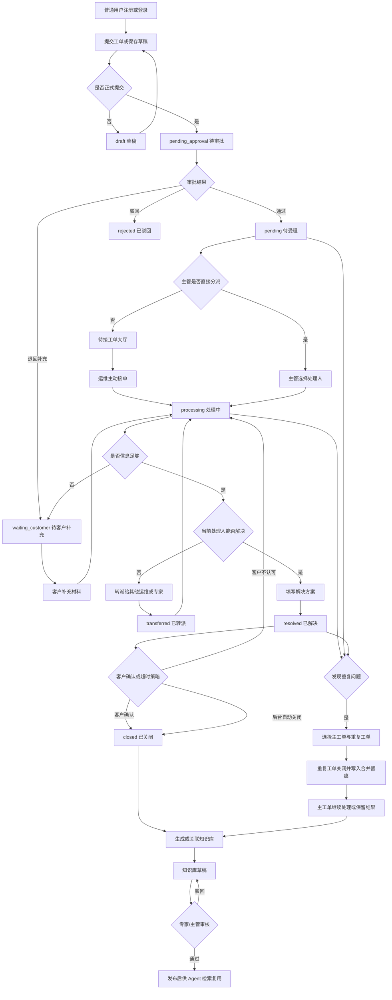

# 头绪工单系统工单流程设计草案

版本：v0.1  
日期：2026-07-03  
状态：待评审

## 1. 目标

本文先确定头绪工单系统的大流程和关键子流程，再进入代码实现。当前目标不是把所有自动化一次写死，而是先把客户、运维、主管、知识库之间的业务边界确定清楚。

核心原则：

- 客户只关心提单、补充信息、查看进度、确认关闭。
- 运维只关心待接工单、自己处理中工单、转派留痕、解决方案。
- 主管只关心分派、合并重复工单、异常兜底、知识沉淀质量。
- 每一次状态变化都必须写入流程记录，包含动作、人、时间、内容、可见范围。
- 重复问题不重复处理，应该合并到主工单，并沉淀到同一篇知识库。

## 2. 角色与职责

| 角色 | 典型账号 | 职责 | 主要页面 |
| --- | --- | --- | --- |
| 普通用户 | customer | 注册、提交工单、补充材料、查看自己的工单、确认关闭 | 我的工单、提交工单、工单详情 |
| 一线运维 | support/operator | 待接大厅接单、初步排查、回复客户、解决或转派 | 待接工单、工单工作台、处理工单 |
| 专家 | expert | 处理疑难问题、接收转派、产出解决方案 | 工单工作台、处理工单、知识库 |
| 主管 | supervisor | 分派工单、合并重复工单、协调人员、审核知识库 | 待接工单、工单工作台、知识库 |
| 管理员 | admin/system_admin | 用户角色、字典、菜单、系统配置、全局兜底 | 系统管理、工单中心 |

## 3. 工单状态

| 状态 | 编码 | 说明 | 可执行动作 |
| --- | --- | --- | --- |
| 草稿 | draft | 用户未正式提交，只有创建人可编辑 | 编辑、提交、放弃 |
| 待审批 | pending_approval | 用户已提交，等待审批人判断是否受理 | 审批通过、退回补充、驳回、撤销、合并 |
| 待受理 | pending | 审批通过但没有处理人 | 接单、分派、驳回、合并 |
| 处理中 | processing | 已有处理人，正在排查 | 回复、待客户补充、转派、解决、合并 |
| 待客户补充 | waiting_customer | 运维需要客户补充材料 | 客户补充、运维继续处理、转派、合并 |
| 已转派 | transferred | 当前处理人发生变化，等待新处理人继续处理 | 回复、继续转派、解决、合并 |
| 已解决 | resolved | 运维给出解决方案，等待客户确认或系统关闭 | 客户关闭、沉淀知识库、合并 |
| 已关闭 | closed | 流程结束，不再处理 | 查看、评价、沉淀知识库 |
| 已驳回 | rejected | 不是有效工单或无法受理 | 查看 |
| 已撤销 | cancelled | 用户或主管在处理前撤销工单 | 查看 |

补充规则：

- `closed`、`rejected` 和 `cancelled` 是终态，不能再转派、分派、处理。
- `resolved` 不是终态，客户确认后才进入 `closed`。
- `resolved` 或 `closed` 在客户不认可时允许重开，重开后进入 `processing` 并增加重开次数。
- 合并后的重复工单进入 `closed`，并记录 `merge_parent_id` 和 `merge_reason`。

## 4. 总体流程

## 5. 用户提交流程

普通用户提交流程：

1. 用户注册或登录。
2. 进入 `提交工单` 页面。
3. 选择所属系统，例如 ERP、CRM、OA、网络与基础设施。
4. 选择问题类型，例如网络问题、系统问题、账号权限、服务器问题、数据问题。
5. 填写标题、问题描述、影响范围、联系方式。
6. 上传图片、文档、日志、视频等附件。
7. 可选择保存草稿或正式提交。
8. 正式提交后系统生成工单编号，状态进入 `pending_approval`，等待审批人受理审核。

字段要求：

| 字段 | 是否必填 | 说明 |
| --- | --- | --- |
| 所属系统 | 必填 | 后续派单和统计的核心依据 |
| 问题类型 | 必填 | 用于筛选、统计、知识库分类 |
| 标题 | 必填 | 应能一眼看懂问题 |
| 问题描述 | 必填 | 建议支持 AI 辅助拆解成现象、步骤、报错 |
| 附件 | 可选 | 图片可直接预览，文档可预览或下载 |
| 联系方式 | 可选 | 默认取用户资料，可覆盖 |

## 6. 人员选择与派单策略

### 6.1 当前建议采用“待接大厅优先”

第一阶段建议采用待接大厅模式：

1. 用户提交后进入 `待接工单`。
2. 有权限的运维人员可以主动接单。
3. 主管可以直接分派给指定处理人。
4. 接单或分派成功后，工单进入 `processing`。

理由：

- 规则简单，适合当前系统先跑通流程。
- 后续可以再接入系统负责人、值班表、负载均衡、随机分配。
- 不会因为配置不完整导致工单自动派错人。

### 6.2 分派候选人规则

候选人来源：

| 来源 | 说明 |
| --- | --- |
| 角色 | admin、system_admin、supervisor、operator、support、expert |
| 账号状态 | 必须启用，未删除 |
| 系统配置 | 后续可按“所属系统”限定候选人 |
| 值班配置 | 后续可按时间、班次、负责人组限定候选人 |

第一阶段人员选择规则：

1. 主管分派时从全部有效运维候选人里选择。
2. 运维接单时不需要选择人员，当前登录人就是处理人。
3. 转派时由当前处理人或主管选择下一任处理人。
4. 转派必须填写当前排查情况和转派原因。

第二阶段可扩展规则：

1. 每个业务系统配置负责人组。
2. 每个负责人组配置成员和优先级。
3. 待接大厅默认按所属系统筛选候选工单。
4. 主管可一键按系统负责人分派。
5. 后续再考虑自动派单、轮询派单、负载派单。

## 7. 内部处理子流程

### 7.1 审批

触发人：主管、系统负责人或管理员。  
入口：`待接工单` 页面中的待审批队列。  
状态变化：

| 场景 | 状态变化 |
| --- | --- |
| 审批通过 | `pending_approval -> pending` |
| 退回补充 | `pending_approval/pending -> waiting_customer` |
| 客户补充后重新审批 | `waiting_customer -> pending_approval` |
| 审批驳回 | `pending_approval/pending -> rejected` |

审批要求：
1. 退回补充和驳回必须填写原因，客户侧可见。
2. 权限、数据、服务器和紧急类工单应重点补充授权依据、影响范围和回滚方案。
3. 审批动作必须写入 `tx_ticket_flow`，不能只修改主表状态。

### 7.2 接单

触发人：运维人员。  
入口：`待接工单`。  
状态变化：`pending -> processing`。审批未通过的 `pending_approval` 工单不能直接接单。  
流程记录：动作 `received`，内容为“处理人接单”。

### 7.3 分派

触发人：主管、管理员。  
入口：`待接工单`、`工单工作台`。  
状态变化：`pending/processing/waiting_customer/transferred -> processing`。  
流程记录：动作 `assigned`，记录原处理人、目标处理人、分派说明。

### 7.4 回复与客户补充

触发人：当前处理人、主管、客户。  
入口：`处理工单`、`工单详情`。  
状态变化：

| 场景 | 状态变化 |
| --- | --- |
| 运维普通回复 | 状态不变 |
| 运维要求补充 | `processing/transferred -> waiting_customer` |
| 客户补充材料 | `waiting_customer -> processing` |

可见范围：

| 可见范围 | 说明 |
| --- | --- |
| public | 客户和内部人员都可见 |
| internal | 仅内部人员可见 |

### 7.5 转派

触发人：当前处理人、主管、管理员。  
入口：`处理工单`。  
状态变化：`processing/waiting_customer/transferred -> transferred`。  
必填内容：当前排查情况、转派原因、下一任处理人。  
流程要求：第一任处理人必须写清已排查内容，方便下一任继续处理。

### 7.6 解决

触发人：当前处理人、主管、管理员。  
入口：`处理工单`。  
状态变化：`processing/waiting_customer/transferred -> resolved`。  
必填内容：最终解决方案。  
后续动作：客户确认关闭，或按超时策略自动关闭。

### 7.7 关闭

触发人：客户、主管、管理员、系统任务。  
状态变化：`resolved -> closed`。  
关闭方式：

| 方式 | 说明 |
| --- | --- |
| 客户确认关闭 | 客户认可解决方案 |
| 主管手动关闭 | 客户长期无反馈或业务确认完成 |
| 系统自动关闭 | 后续可配置，例如 resolved 后 7 天自动关闭 |

### 7.8 重开、评价与 SLA 提醒

| 动作 | 状态变化 | 说明 |
| --- | --- | --- |
| 重开 | `resolved/closed -> processing` | 客户不认可解决结果或主管复核发现未闭环时使用，并增加重开次数 |
| 评价 | `closed -> closed` | 客户关闭后评分和备注，写入主表评价字段并保留流程记录 |
| SLA 提醒 | 状态不变 | 主管对响应超时、解决超时或人工关注场景写入内部提醒 |

## 8. 重复工单合并流程

合并目标：相同问题只保留一张主工单继续处理，重复工单关闭并保留追溯。

适用场景：

- 多个客户提出同一系统同一故障。
- 同一客户重复提交相同问题。
- 客户描述不同，但运维确认根因一致。
- 已有解决方案，新的工单可直接关联到历史知识。

合并规则：

1. 主管或管理员选择一张主工单。
2. 选择一张或多张重复工单。
3. 填写合并说明。
4. 重复工单状态改为 `closed`。
5. 重复工单记录 `merge_parent_id` 和 `merge_reason`。
6. 重复工单写入 `merged` 流程记录，对客户可见。
7. 主工单写入 `merged` 流程记录，内部可见。
8. 如果关联了知识库文章，主工单和重复工单都关联到同一篇知识。

合并限制：

- 主工单不能合并自己。
- `closed/rejected` 终态工单不建议再次作为重复工单合并。
- 已经合并过的重复工单不能再次合并到另一张主工单。
- 合并不是删除，重复工单仍可查看历史。

## 9. 知识库沉淀流程

知识库目标：把已解决问题沉淀为可复用方案，为后续 Agent 推荐做准备。

触发场景：

| 场景 | 动作 |
| --- | --- |
| 工单已解决 | 生成知识库草稿 |
| 多个工单同一问题 | 合并后关联到同一篇知识 |
| 运维手工总结 | 新增知识库文章 |
| Agent 推荐命中 | 后续记录推荐来源和是否有效 |

知识库字段语义：

| 字段 | 说明 |
| --- | --- |
| 标准问题标题 | 面向检索的标准标题，不一定等于客户原始标题 |
| 问题类型 | 与工单问题类型一致，用于统计 |
| 检索标签 | 系统名、模块名、报错词、关键词，用于 Agent 检索 |
| 问题现象 | 客户看到的问题表现 |
| 原因分析 | 运维排查后的根因 |
| 解决步骤 | 可复用的处理步骤 |
| 适用范围 | 适用系统、版本、环境、限制条件 |
| 首个来源工单 | 这篇知识最早来自哪张工单 |
| 相同问题工单 | 后续关联、合并、复用过的工单 |

知识库发布建议：

1. 运维可以创建草稿。
2. 运维保存草稿后提交审核，状态进入 `reviewing`。
3. 专家或主管审核内容，通过后发布，驳回则进入 `rejected` 并记录原因。
4. 发布后才进入 Agent 检索源。
5. 已发布知识可以下架，不物理删除。
6. 每次 Agent 命中后应记录是否解决客户问题。

## 10. 页面与菜单建议

| 页面 | 面向角色 | 核心能力 |
| --- | --- | --- |
| 工单首页 | 所有人 | 最近工单、快捷入口、统计概览 |
| 提交工单 | 普通用户 | 创建草稿、正式提交、上传附件、AI 辅助描述 |
| 我的工单 | 普通用户 | 查看自己提交的工单、草稿、处理进度 |
| 待接工单 | 运维、主管 | 待接大厅、接单、分派、合并入口 |
| 工单工作台 | 运维、主管 | 我处理中、我已完成、全部工单 |
| 处理工单 | 当前处理人 | 回复、内部备注、要求补充、转派、解决 |
| 工单详情 | 所有人按权限 | 原始问题、流程记录、附件、合并提示 |
| 知识库 | 运维、专家、主管 | 方案维护、发布、关联工单、Agent 数据源 |
| 系统配置 | 主管、管理员 | 维护业务系统和后续派单策略 |

## 11. 后续待定问题

以下问题建议在正式实现第二阶段前确认：

1. 是否需要“客户评价”字段，例如满意、不满意、未评价。
2. 是否需要 SLA，例如紧急工单 2 小时响应、8 小时解决。
3. 是否需要“系统负责人组”和“值班表”。
4. 自动派单是按系统、按负载、按轮询，还是只保留人工分派。
5. Agent 推荐是否在提单前触发，还是提交后由运维查看推荐。
6. 合并工单是否允许客户侧看到主工单详情，还是只展示合并说明。
7. 知识库发布是否需要审核流。

## 12. 当前建议的开发顺序

1. 固化状态机和流程记录展示。
2. 完善提单页字段：所属系统、问题类型、附件、AI 辅助描述。
3. 完善待接工单和工单工作台边界。
4. 完善处理页：回复、要求补充、转派、解决。
5. 完善合并重复工单。
6. 完善知识库草稿、关联工单、发布。
7. 再做自动派单、SLA、Agent 推荐。
